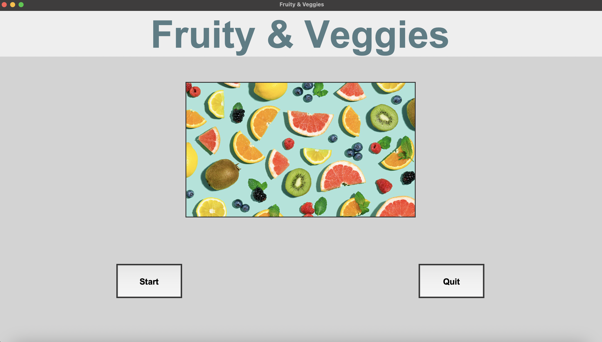
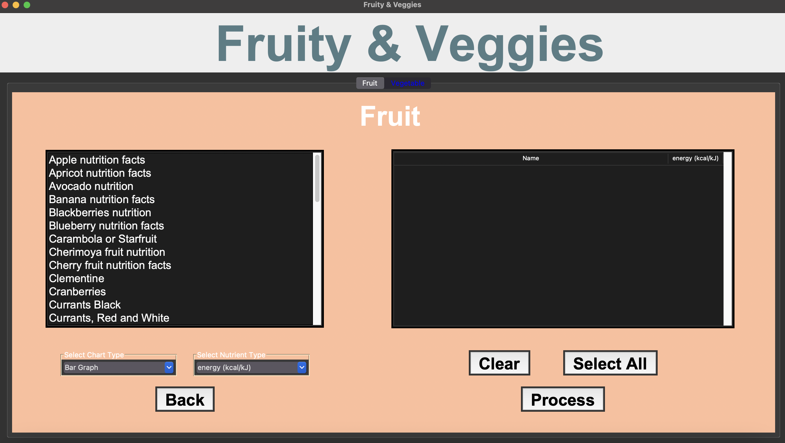
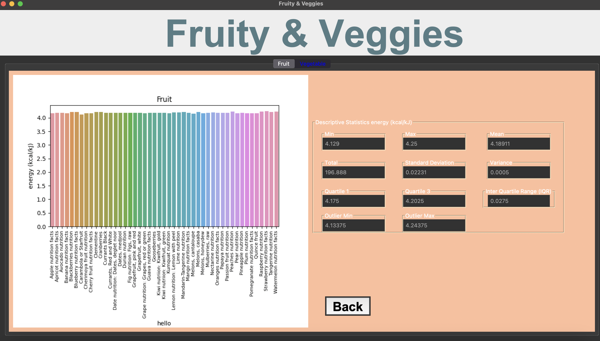

# Fruity & Veggie Project

## Description

My project is to create an app that helps users track their nutritional intake from fruits and vegetables. 
A feature that uses graph algorithms is a visualization of nutrient content based on user input. 
Users can record their consumption of fruits and vegetables. 
Then the app will show graphs and charts showing nutrients.

* <h3> First-Page </h3>


* <h3> Second-Page </h3>


* <h3> Third-Page </h3>



## Data Sources

[//]: # (List the data sources used by the application, along with their descriptions)

[//]: # (and links.)
* [Download Fruit CSV File](fruits.csv)
* [Download Vegetable CSV File](vegetables.csv)

 
## Running the Application

 
## Design
* [UML Class Diagram](UML_Fruity&Veggie.png)

    - `main.py` : This file serves as the entry point for the application and runs the program.
    - `container.py` : This file contains the Container() class, which is responsible for pulling in different widget creations for the app.
    - `widget.py` : This file contains the Widget() class, which is used for creating widgets that can be added to the Container() class.
    - `process.py` : This file contains the GraphProcessor() class, which is dedicated to graphing nutrient data based on user input.
  
* [Sequence Diagram](sequence-diagram.png)

    - Scenario for create a homepage(first page).
 
## Design Patterns Used
In our project, we have used the "Facade" design pattern. 
 
## Graph Algorithm Used
User wants to find the path with the least nutritional between two fruits/vegetables. Specifically, the user wants to find the path that minimizes the total in nutrients between the starting and ending fruits/vegetables.

* There is a vertex for each fruit/vegetable. Assume there are ‘n’ (V/ = n).
* There is a directed edge ‘m’ each edge is nutrient (E/ = m).
* The associated value is the positive value of nutrients. 
* To find the shortest path from fruit/vegetable vertex A to vertex B.
* Using Dijkstra’s algorithm from vertex A to vertex B to solve the problem.
* The algorithm runs is O(E/ log V/) = O(n log m).
 
## Other Information

Before run a program install a package!. Copy and Paste in terminal.

```commandline
pip install -r requirements.txt
```
